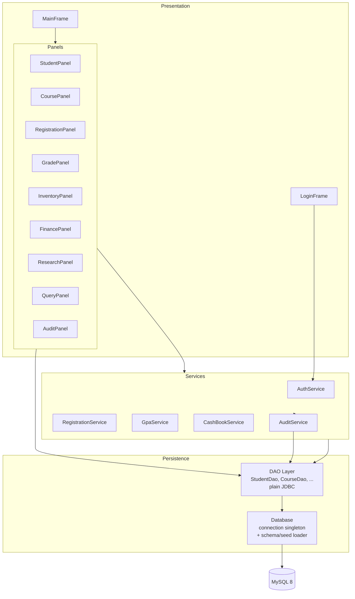
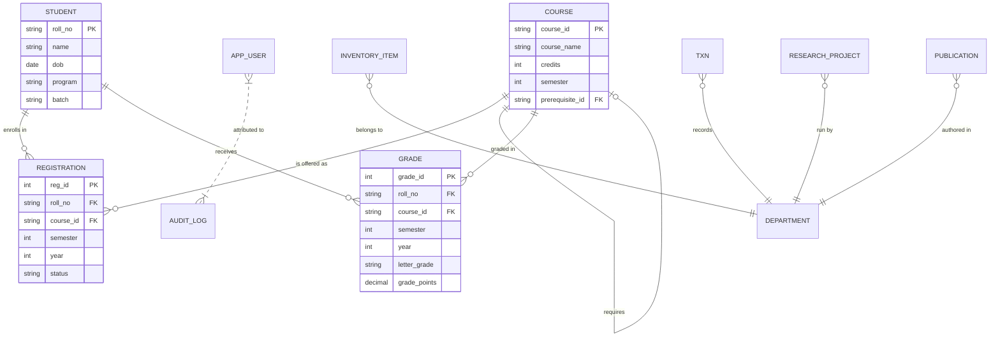
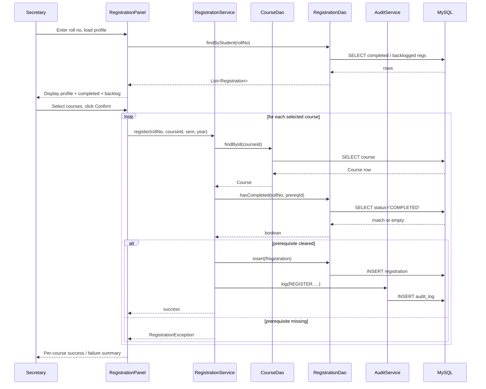

# UDIS - University Department Information System

A desktop application that centralizes the administrative operations of a
university department: student records, course catalogue, semester
registration, grading, inventory, finance, and research tracking. Built to
the specification laid out in *SRS v1.0* (University Department Information
System).

UDIS replaces ad-hoc spreadsheets and paper registers with a single,
auditable, role-based system that keeps academic, financial, and asset
records consistent in real time.

## Contents

- [Overview](#overview)
- [Features](#features)
- [Architecture](#architecture)
- [Domain Model](#domain-model)
- [Data Flow](#data-flow)
- [Tech Stack](#tech-stack)
- [Getting Started](#getting-started)
- [Configuration](#configuration)
- [Default Accounts](#default-accounts)
- [Project Structure](#project-structure)
- [Roadmap](#roadmap)
- [Contributing](#contributing)
- [Authors](#authors)

## Overview

UDIS is a Java Swing desktop client backed by a MySQL relational store.
It is scoped to a single department (multi-department support is on the
roadmap) and designed around four user classes with distinct permissions:
**Secretary**, **Head of Department (HOD)**, **Faculty**, and **System
Administrator**.

The application targets office-class hardware and is intentionally
lightweight: no external application server, no container runtime, and no
network services beyond the JDBC connection to MySQL.

## Features

| ID    | Feature                                         | Module |
|-------|-------------------------------------------------|--------|
| F-01  | Student profile management with duplicate-roll-number detection | `StudentPanel` |
| F-02  | Course catalogue with prerequisite relationships                | `CoursePanel`  |
| F-03  | Semester registration with automatic prerequisite validation    | `RegistrationPanel` + `RegistrationService` |
| F-04  | Grade entry with automatic GPA and CGPA computation             | `GradePanel` + `GpaService` |
| F-05  | Printable, formatted grade sheets                               | `GradePanel` via `JEditorPane.print()` |
| F-06  | Inventory register with search, filtering, and disposal marking | `InventoryPanel` |
| F-07  | Cash-book transaction management with live running balance      | `FinancePanel` + `CashBookService` |
| F-08  | Financial reporting with date-range filters                     | `FinancePanel` summary dialog |
| F-09  | Research project and publication tracking                       | `ResearchPanel` |
| F-10  | Consolidated student information query                          | `QueryPanel` |
| F-11  | Role-based access control                                       | `AuthService` |
| F-12  | Audit logging of logins and data mutations                      | `AuditService` + `AuditPanel` |

## Architecture

UDIS follows a classic three-layer architecture (presentation - service -
persistence) within a single desktop process.



Key design choices:

- **Separation of concerns.** Each Swing panel owns only UI concerns and
  delegates all business rules to services or DAOs.
- **Stateless services.** Services hold no per-user state; the currently
  authenticated principal is kept in `AuthService.currentUser()` and read
  on demand.
- **Single JDBC connection.** A `Database` singleton owns one
  `java.sql.Connection`. This is sufficient for a single-user desktop
  workload; connection pooling is planned for multi-client deployments.
- **Schema bootstrapping.** Schema and seed scripts are loaded from the
  classpath at first launch, so the application is installable with zero
  manual database preparation.

## Domain Model



The *DEPARTMENT* relationships are logical in the current release (the
system is scoped to a single department) and become physical FK columns
in Phase 4.

## Data Flow

The following sequence illustrates the most representative end-to-end
flow - semester registration with prerequisite validation.



Grade entry follows the same pattern: the UI collects inputs,
`GpaService` is invoked to derive grade points and updated semester GPA,
`GradeDao.upsert(...)` persists the grade, the corresponding
`Registration.status` is flipped to `COMPLETED` or `BACKLOG`, and an
audit entry is written.

## Tech Stack

| Concern              | Choice                                      |
|----------------------|---------------------------------------------|
| Language             | Java 17                                     |
| UI                   | Swing with FlatLaf 3.4 look-and-feel        |
| Persistence          | MySQL 8, plain JDBC via `mysql-connector-j` |
| Password hashing     | `jBCrypt` 0.4                               |
| Build                | Apache Maven 3.8+                           |
| Packaging            | `maven-shade-plugin` (runnable fat JAR)     |
| Backup utility       | `mysqldump` (shelled out from the app)      |

## Getting Started

### Prerequisites

- JDK 17 or newer (`java -version`)
- Apache Maven 3.8 or newer (`mvn -version`)
- A running MySQL 8 server reachable on `localhost:3306`
- `mysqldump` on the `PATH` (only required for the in-app backup action)

### Build

```bash
mvn clean package
```

This produces a self-contained runnable archive at `target/udis.jar`.

### Run

```bash
java -jar target/udis.jar
```

Alternatively, during development:

```bash
mvn compile exec:java -Dexec.mainClass=com.udis.Main
```

On first launch, UDIS:

1. Connects to MySQL, creating the `udis` database if it does not exist.
2. Executes `schema.sql` to create all tables with the necessary
   primary- and foreign-key constraints.
3. If `app_user` is empty, loads `seed.sql` (reference data) and
   inserts the default user accounts with BCrypt-hashed passwords.

## Configuration

Runtime configuration lives in `src/main/resources/config.properties`:

```properties
jdbc.url=jdbc:mysql://localhost:3306/udis?useSSL=false&serverTimezone=UTC&allowPublicKeyRetrieval=true&createDatabaseIfNotExist=true
jdbc.user=root
jdbc.password=root
maintenance=false
```

| Key             | Description                                                        |
|-----------------|--------------------------------------------------------------------|
| `jdbc.url`      | JDBC URL to the MySQL instance                                     |
| `jdbc.user`     | Database user. Must have rights to create tables on first launch.  |
| `jdbc.password` | Database password                                                  |
| `maintenance`   | When `true`, only users with the `ADMIN` role may sign in          |

## Default Accounts

The bootstrap seed creates one account per role. Passwords are stored as
BCrypt hashes; the values below are only the initial plaintexts and
should be rotated before any multi-user deployment.

| Role      | Username    | Initial Password | Permissions                                           |
|-----------|-------------|------------------|-------------------------------------------------------|
| Secretary | `secretary` | `secretary123`   | Full read/write across all operational modules        |
| HOD       | `hod`       | `hod123`         | Read access across all modules; reports and queries   |
| Faculty   | `faculty`   | `faculty123`     | Read access to students, courses, and grade records   |
| Admin     | `admin`     | `admin123`       | Access to the audit log and system-level operations   |

## Project Structure

```
udis/
├── pom.xml
├── README.md
└── src/main/
    ├── java/com/udis/
    │   ├── Main.java
    │   ├── db/            Database bootstrap and connection management
    │   ├── model/         Plain Java domain objects (9 entities)
    │   ├── dao/           JDBC DAOs, one per aggregate
    │   ├── service/       Business rules: auth, registration, GPA, cash-book, audit
    │   └── ui/            Swing frames and panels (one per SRS feature)
    └── resources/
        ├── schema.sql     DDL for all tables and constraints
        ├── seed.sql       Reference and sample data
        └── config.properties
```

## Roadmap

Effort is expressed in calendar weeks for a four-person engineering
team. Estimates are indicative and should be revisited during each
phase's kickoff.

### Phase 0 - Requirements and Planning (1 week) - completed

- SRS v1.0 authored, reviewed, and baselined.
- Technology selection and architectural decisions.
- Database schema design (10 entities, SRS §3.4).
- MVP scope freeze covering all 12 features at a baseline level.

### Phase 1 - MVP Implementation (2 weeks) - completed

- Maven project scaffold with fat-jar packaging.
- MySQL schema and seed data auto-loaded on first launch.
- Authentication with BCrypt-hashed credentials and four seeded roles.
- All twelve SRS features (F-01 to F-12) delivered as independent Swing
  panels behind a single `JTabbedPane`.
- Core computations: GPA, CGPA, prerequisite validation, running
  cash-book balance, printable grade sheet.
- Role-gated UI, manual database backup via `mysqldump`, audit trail
  for logins and mutations.

### Phase 2 - Hardening and UX (1.5 weeks)

Goal: production-grade robustness and operator ergonomics.

| Work Item                                                              | Effort |
|------------------------------------------------------------------------|--------|
| Replace free-text date inputs with a date-picker component             | 1 day  |
| Inline, per-field input validation across all forms                    | 2 days |
| HikariCP connection pool replacing the singleton `Connection`          | 1 day  |
| Transactional "Save Grades" operation (atomic multi-row commit)        | 1 day  |
| JUnit 5 test suite for `GpaService`, `RegistrationService`, `CashBookService` | 2 days |
| Keyboard accelerators (Save, Search, Clear, etc.)                      | 0.5 day |
| Application icon and splash screen                                     | 0.5 day |

### Phase 3 - SRS Compliance Uplift (2 weeks)

Close the deliberate MVP shortcuts against the letter of the SRS.

| Work Item                                                              | Effort |
|------------------------------------------------------------------------|--------|
| Automated daily backups via `ScheduledExecutorService`                 | 1 day  |
| Runtime-toggled Maintenance Mode with system-wide banner               | 1 day  |
| Configurable grading scheme stored in a `grade_scheme` table           | 2 days |
| Administrator UI for user creation, deactivation, password reset       | 2 days |
| Field-level audit diffs (before/after values) with enriched schema     | 2 days |
| PDF grade-sheet export via Apache PDFBox                               | 2 days |
| CSV/Excel export for finance and inventory reports                     | 1 day  |

### Phase 4 - Scale-out and Extension (3-4 weeks)

Optional work to extend the system beyond its initial single-department
scope, as anticipated by SRS §3.6 (Scalability).

| Work Item                                                              | Effort |
|------------------------------------------------------------------------|--------|
| Multi-department support with a `department_id` discriminator          | 1 week |
| Migration to Spring Boot and JPA/Hibernate (backend)                   | 1 week |
| Web front-end (React or Thymeleaf) served by the Spring backend        | 2 weeks |
| Role-specific dashboards with aggregate KPIs                           | 3 days |
| Email notifications for grade publication and registration confirmation | 2 days |

### Timeline Summary

| Phase                                 | Status    | Effort       |
|---------------------------------------|-----------|--------------|
| 0. Requirements and Planning          | Completed | 1 week       |
| 1. MVP Implementation                 | Completed | 2 weeks      |
| 2. Hardening and UX                   | Planned   | 1.5 weeks    |
| 3. SRS Compliance Uplift              | Planned   | 2 weeks      |
| 4. Scale-out and Extension            | Stretch   | 3 - 4 weeks  |

## Contributing

1. Create a feature branch from `main`: `git checkout -b feature/<topic>`.
2. Keep changes scoped to one module where possible; the codebase is
   deliberately modular so that each SRS feature can evolve
   independently.
3. Write or update unit tests for any change to `com.udis.service.*`.
4. Ensure `mvn clean package` succeeds before opening a pull request.
5. Follow the existing code style: 4-space indentation, no wildcard
   imports, constructor-based wiring for services.

## Authors

- Aditya Sharma
- Aishwary Dixit
- Vijit Vishnoi
- Abhinav Kumar Srivastava
