# UDIS – Mermaid Diagram Codes
**University Department Information System**

Paste any block below at [https://mermaid.live](https://mermaid.live) to preview instantly.

---

## 1. DFD Level 0 – Context Diagram
*(Represented as a flowchart — Mermaid has no native DFD type)*

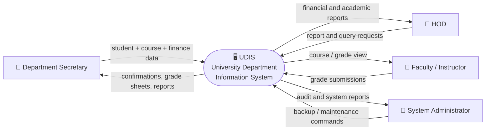

---

## 2. DFD Level 1 – Process Decomposition

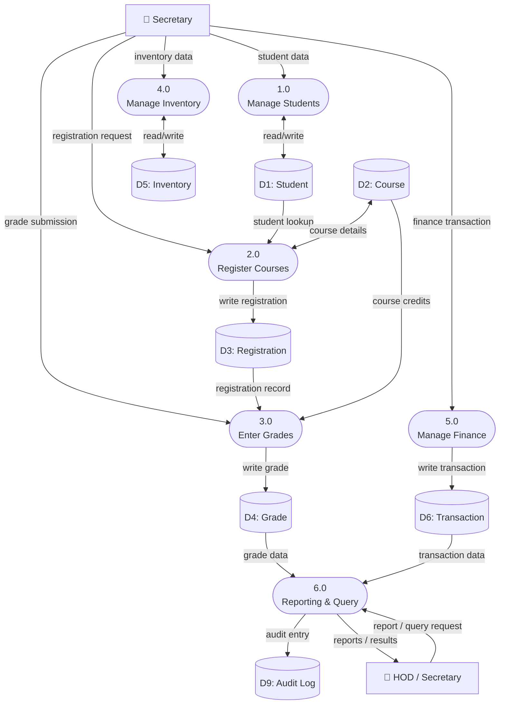

---

## 3. DFD Level 2 – Sub-process Decomposition

### 3a. Process 1.0 – Manage Students

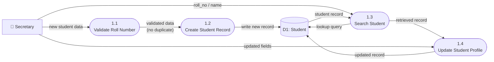

---

### 3b. Process 2.0 – Register Courses

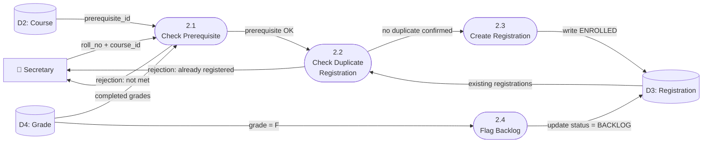

---

### 3c. Process 3.0 – Enter Grades

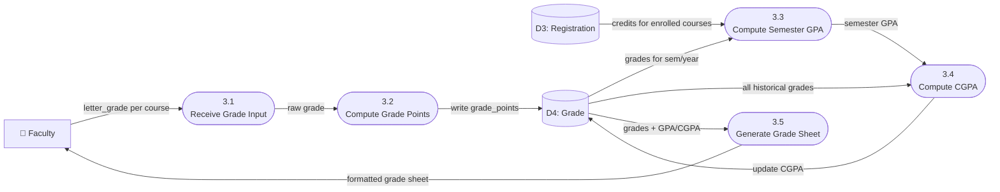

---

### 3d. Process 4.0 – Manage Inventory

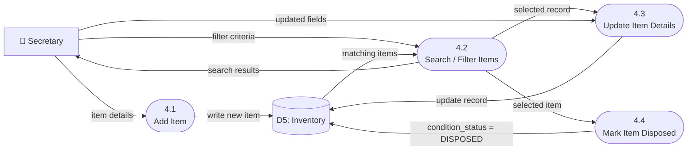

---

### 3e. Process 5.0 – Manage Finance

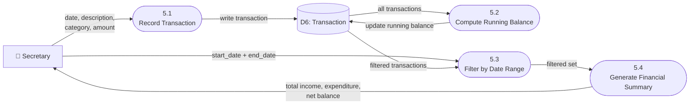

---

## 4. UML Diagrams

---

### 4a. Use Case Diagram

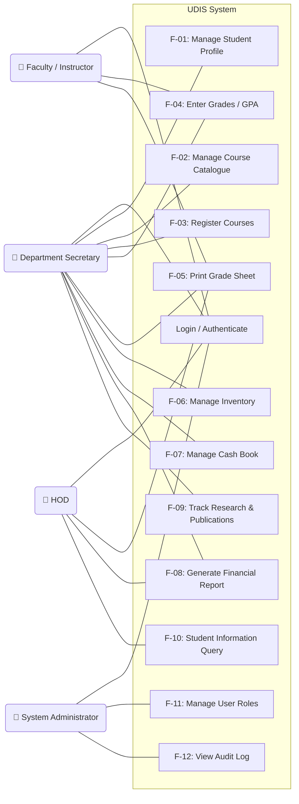

---

### 4b. Class Diagram

```mermaid
classDiagram
    class Student {
        +String roll_no PK
        +String name
        +Date dob
        +String gender
        +String program
        +int batch
        +String address
        +String contact
    }

    class Course {
        +String course_id PK
        +String course_name
        +int credits
        +int semester
        +String prerequisite_id FK
    }

    class Registration {
        +int reg_id PK
        +String roll_no FK
        +String course_id FK
        +int semester
        +int year
        +String status
    }

    class Grade {
        +int grade_id PK
        +String roll_no FK
        +String course_id FK
        +int semester
        +int year
        +String letter_grade
        +double grade_points
    }

    class InventoryItem {
        +int item_id PK
        +String name
        +String category
        +String serial_number
        +String location
        +Date acquisition_date
        +String condition_status
    }

    class Transaction {
        +int txn_id PK
        +Date txn_date
        +String description
        +String category
        +double amount
    }

    class ResearchProject {
        +int project_id PK
        +String title
        +String PI
        +String funding_source
        +Date start_date
        +Date end_date
        +String status
    }

    class Publication {
        +int pub_id PK
        +String title
        +String authors
        +String journal
        +int year
        +String doi
    }

    class AppUser {
        +int user_id PK
        +String username
        +String password_hash
        +String role
        +String full_name
    }

    class AuditLog {
        +int id PK
        +String username
        +String action
        +String entity
        +DateTime at_time
    }

    class AuthService {
        +login(username, password) AppUser
        +canAccess(module) boolean
        +canWrite(module) boolean
    }

    class RegistrationService {
        +register(rollNo, courseId, sem, year) Registration
        +checkPrerequisite(rollNo, courseId) boolean
        +checkDuplicate(rollNo, courseId, sem, year) boolean
    }

    class GpaService {
        +computeSemesterGPA(rollNo, sem, year) double
        +computeCGPA(rollNo) double
        +letterToPoints(letterGrade) double
    }

    class CashBookService {
        +addTransaction(txn) void
        +getRunningBalance() double
        +getSummary(from, to) FinancialReport
    }

    class AuditService {
        +log(username, action, entity) void
    }

    Student "1" --> "0..*" Registration : enrolled in
    Course "1" --> "0..*" Registration : registered for
    Student "1" --> "0..*" Grade : receives
    Course "1" --> "0..*" Grade : assessed by
    Course "0..1" --> "0..*" Course : prerequisite of

    AppUser ..> AuthService : uses
    RegistrationService ..> Registration : creates
    RegistrationService ..> Grade : reads
    GpaService ..> Grade : reads
    CashBookService ..> Transaction : manages
    AuditService ..> AuditLog : writes
```

---

### 4c. Sequence Diagram – Course Registration Flow

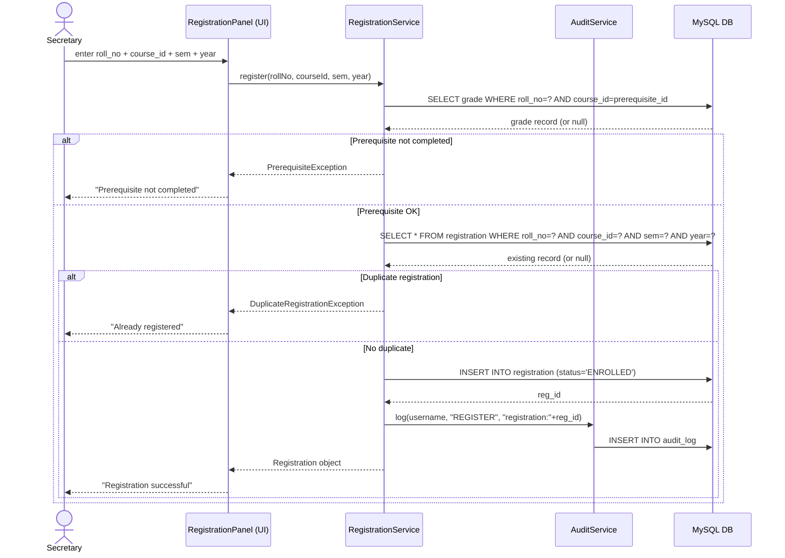

---

### 4d. Sequence Diagram – Grade Entry & GPA Computation

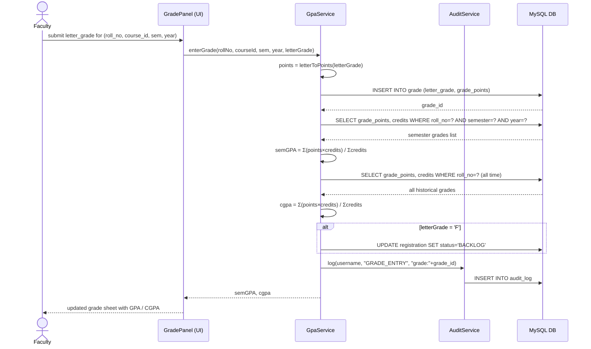

---

### 4e. State Diagram – Registration Lifecycle

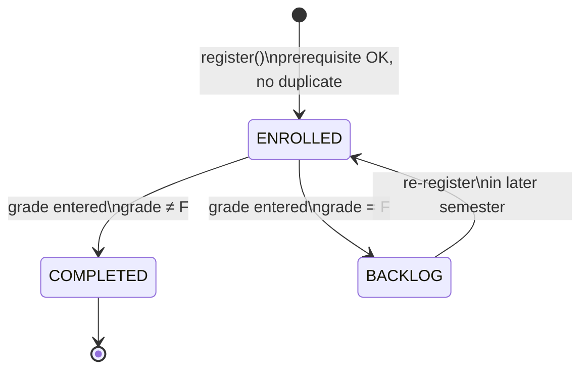

---

### 4f. Activity Diagram – Login & Access Control

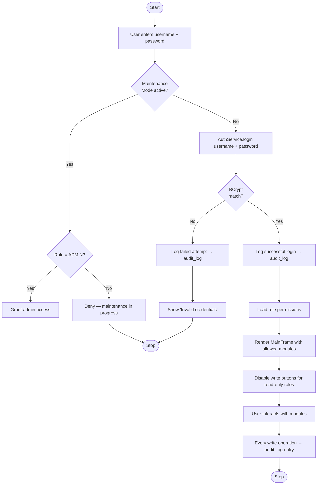

---

## Quick Reference

| Diagram | Mermaid type used |
|---|---|
| DFD Level 0, 1, 2 | `flowchart` |
| Use Case | `graph LR` |
| Class Diagram | `classDiagram` |
| Sequence Diagrams | `sequenceDiagram` |
| State Diagram | `stateDiagram-v2` |
| Activity Diagram | `flowchart TD` |

**Preview any block instantly:** paste at [https://mermaid.live](https://mermaid.live)
