# UDIS - Mermaid Diagrams (SmartDraw-compatible)

**University Department Information System**

Each block below is adapted for SmartDraw's mermaid importer:

- `graph LR` replaced with `flowchart LR`
- Emojis removed (SmartDraw often can't render them)
- `\n` inside node labels replaced with ` `
- `subgraph` names with spaces rewritten in `id [Label]` form
- Unicode math (Sigma / x / not-equal) replaced with ASCII
- All labels with punctuation quoted

If you ever want the prettier emoji / Unicode versions again, use
`UDIS_Mermaid_Codes.md` at mermaid.live.

---

## 1. DFD Level 0 - Context Diagram

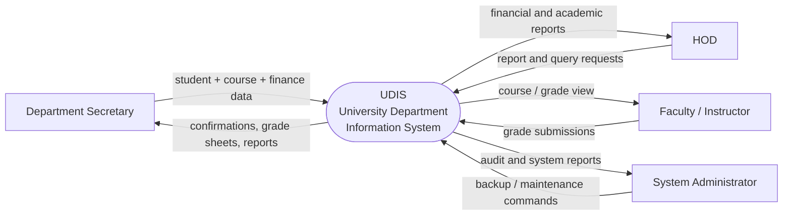

---

## 2. DFD Level 1 - Process Decomposition

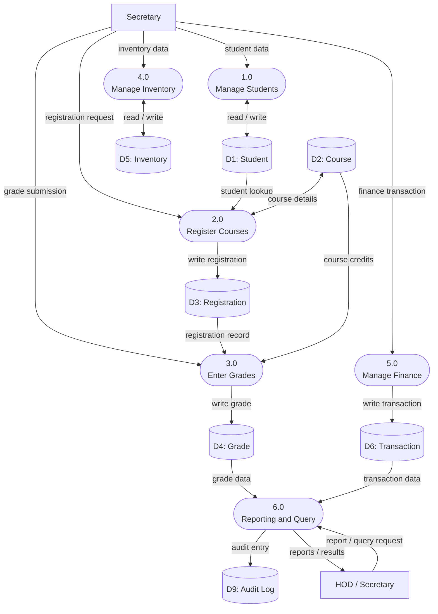

---

## 3. DFD Level 2 - Sub-process Decomposition

### 3a. Process 1.0 - Manage Students

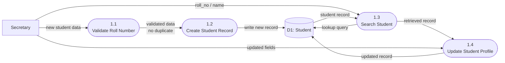

---

### 3b. Process 2.0 - Register Courses

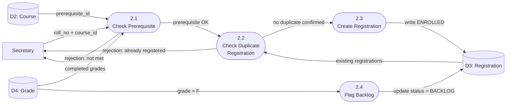

---

### 3c. Process 3.0 - Enter Grades

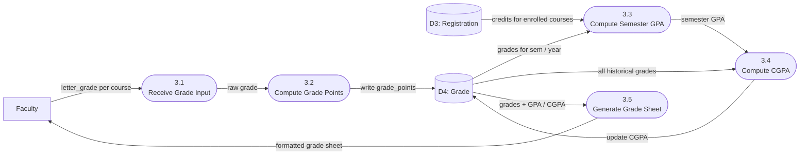

---

### 3d. Process 4.0 - Manage Inventory

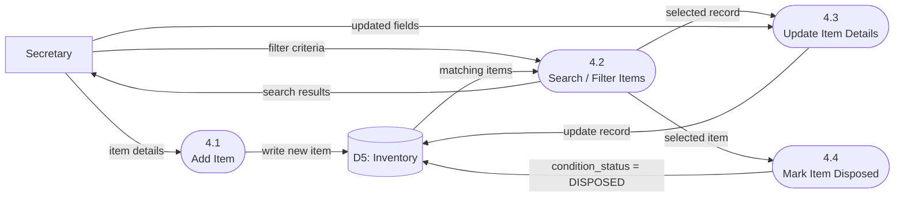

---

### 3e. Process 5.0 - Manage Finance

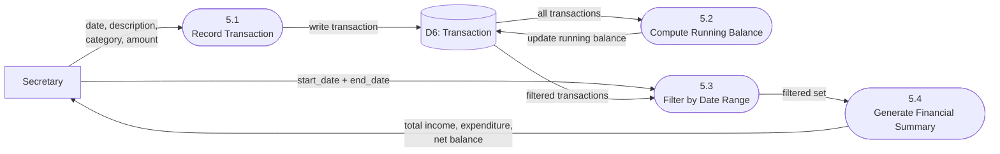

---

## 4. UML Diagrams

---

### 4a. Use Case Diagram

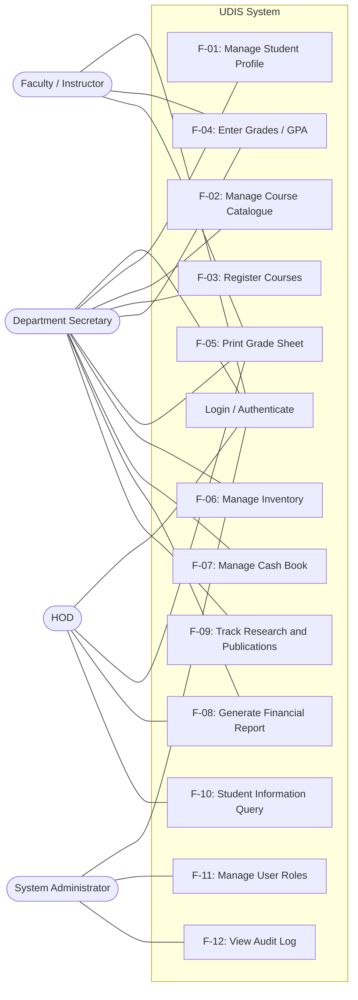

---

### 4b. Class Diagram

```mermaid
classDiagram
    class Student {
        +String roll_no
        +String name
        +Date dob
        +String gender
        +String program
        +int batch
        +String address
        +String contact
    }

    class Course {
        +String course_id
        +String course_name
        +int credits
        +int semester
        +String prerequisite_id
    }

    class Registration {
        +int reg_id
        +String roll_no
        +String course_id
        +int semester
        +int year
        +String status
    }

    class Grade {
        +int grade_id
        +String roll_no
        +String course_id
        +int semester
        +int year
        +String letter_grade
        +double grade_points
    }

    class InventoryItem {
        +int item_id
        +String name
        +String category
        +String serial_number
        +String location
        +Date acquisition_date
        +String condition_status
    }

    class Transaction {
        +int txn_id
        +Date txn_date
        +String description
        +String category
        +double amount
    }

    class ResearchProject {
        +int project_id
        +String title
        +String PI
        +String funding_source
        +Date start_date
        +Date end_date
        +String status
    }

    class Publication {
        +int pub_id
        +String title
        +String authors
        +String journal
        +int year
        +String doi
    }

    class AppUser {
        +int user_id
        +String username
        +String password_hash
        +String role
        +String full_name
    }

    class AuditLog {
        +int id
        +String username
        +String action
        +String entity
        +DateTime at_time
    }

    class AuthService {
        +login(username, password) AppUser
        +canAccess(module) boolean
        +canWrite(module) boolean
    }

    class RegistrationService {
        +register(rollNo, courseId, sem, year) Registration
        +checkPrerequisite(rollNo, courseId) boolean
        +checkDuplicate(rollNo, courseId, sem, year) boolean
    }

    class GpaService {
        +computeSemesterGPA(rollNo, sem, year) double
        +computeCGPA(rollNo) double
        +letterToPoints(letterGrade) double
    }

    class CashBookService {
        +addTransaction(txn) void
        +getRunningBalance() double
        +getSummary(from, to) FinancialReport
    }

    class AuditService {
        +log(username, action, entity) void
    }

    Student "1" --> "0..*" Registration : enrolled in
    Course "1" --> "0..*" Registration : registered for
    Student "1" --> "0..*" Grade : receives
    Course "1" --> "0..*" Grade : assessed by
    Course "0..1" --> "0..*" Course : prerequisite of

    AppUser ..> AuthService : uses
    RegistrationService ..> Registration : creates
    RegistrationService ..> Grade : reads
    GpaService ..> Grade : reads
    CashBookService ..> Transaction : manages
    AuditService ..> AuditLog : writes
```

---

### 4c. Sequence Diagram - Course Registration Flow

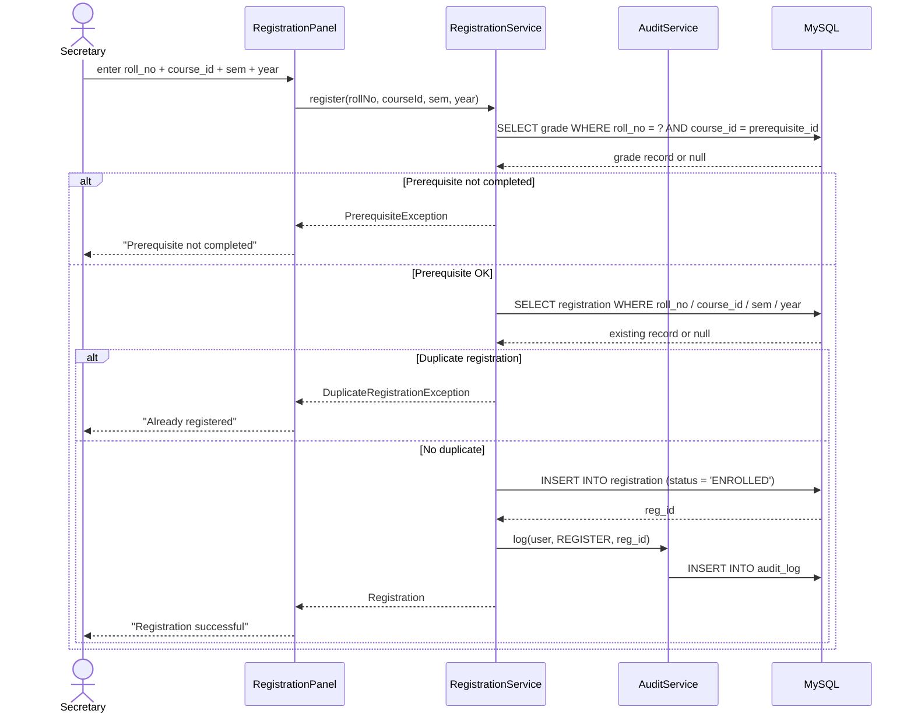

---

### 4d. Sequence Diagram - Grade Entry and GPA Computation

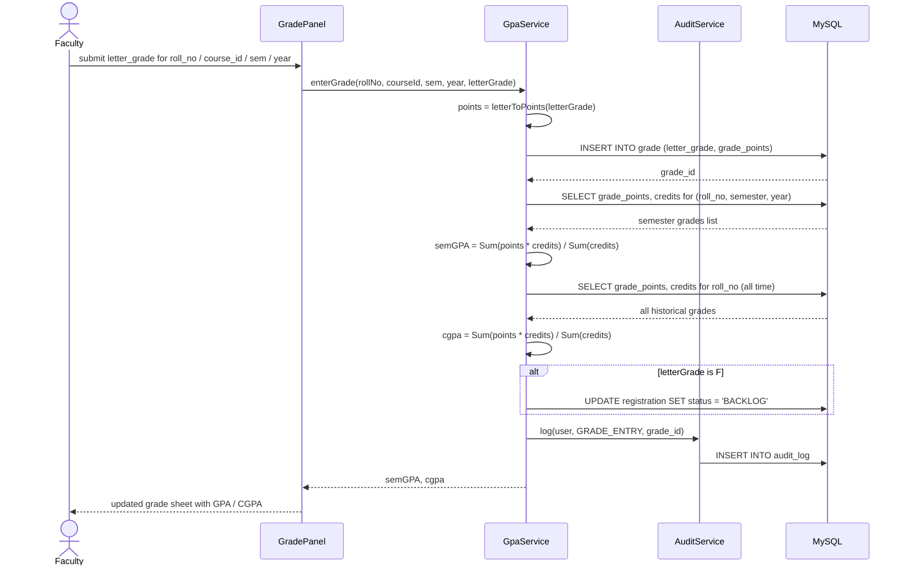

---

### 4e. State Diagram - Registration Lifecycle

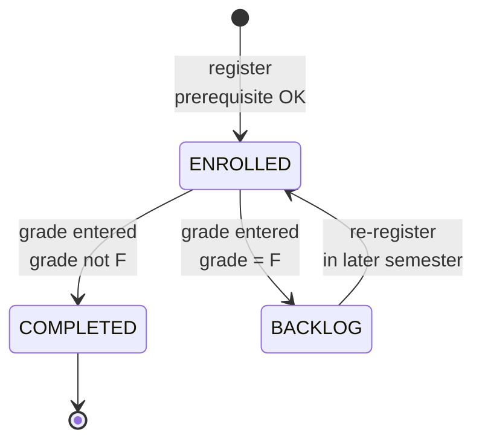

> If SmartDraw rejects `stateDiagram-v2`, change the first line to `stateDiagram`.

---

### 4f. Activity Diagram - Login and Access Control

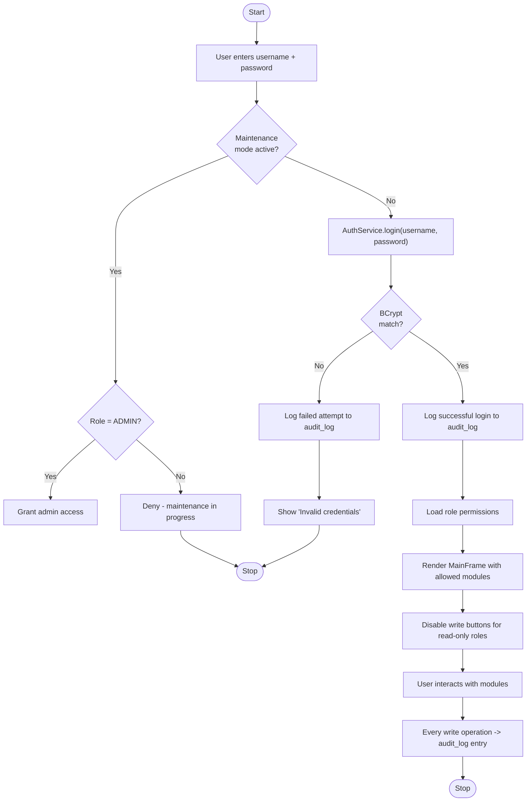

---

## Quick Reference

| Diagram                      | Mermaid type used    |
|------------------------------|----------------------|
| DFD Level 0, 1, 2            | `flowchart`          |
| Use Case                     | `flowchart LR`       |
| Class Diagram                | `classDiagram`       |
| Sequence Diagrams            | `sequenceDiagram`    |
| State Diagram                | `stateDiagram-v2`    |
| Activity Diagram             | `flowchart TD`       |

## If SmartDraw still complains

Usual culprits, in order of likelihood:

1. **Copy-paste ate the indentation.** SmartDraw's parser is whitespace-sensitive inside `subgraph` / `alt / else / end`. Preserve leading spaces.
2. **Extra trailing spaces or a BOM character.** Paste into a plain-text editor first.
3. **`stateDiagram-v2` not recognized.** Fall back to `stateDiagram`.
4. **Curly braces `{ ... }` in class method arguments.** Simplify signatures.
5. **Relationship labels with `:` inside them.** Wrap the whole label in quotes: `A "1" --> "0..*" B : "label"`.
6. **`subgraph` with spaces in its name.** Use the `id [Label]` form (already applied above).
